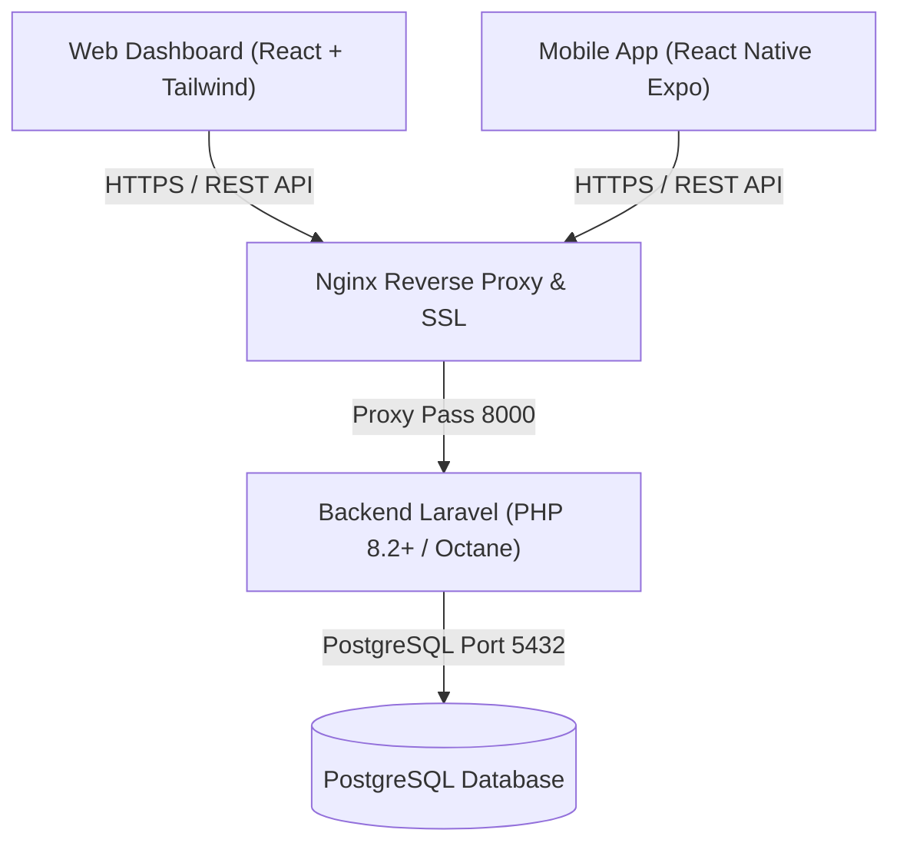

# Panduan Deployment & Produksi KasirKita POS

Dokumen ini berisi panduan teknis langkah demi langkah untuk melakukan rilis dan deployment sistem **KasirKita POS** ke lingkungan server produksi.

---

## 1. Arsitektur Komponen



---

## 2. Persyaratan Server (Minimum Specs)

- **OS:** Ubuntu 22.04 LTS / 24.04 LTS
- **CPU:** 2 vCPU
- **RAM:** 4 GB (disarankan 8 GB jika transaksi kasir tinggi)
- **Disk:** 40 GB SSD (NVMe disarankan)
- **Software:**
  - Docker & Docker Compose ATAU Nginx + PHP 8.2+ + PostgreSQL 16 + Node.js 20+

---

## 3. Deployment Backend (Laravel REST API)

### Langkah Konfigurasi Environment:
1. Salin `.env.example` menjadi `.env`:
   ```bash
   cp .env.example .env
   ```
2. Sesuaikan konfigurasi database dan CORS:
   ```env
   APP_NAME="KasirKita POS"
   APP_ENV=production
   APP_DEBUG=false
   APP_URL=https://api.kasirkita.com

   DB_CONNECTION=pgsql
   DB_HOST=127.0.0.1
   DB_PORT=5432
   DB_DATABASE=kasirkita_db
   DB_USERNAME=kasirkita_user
   DB_PASSWORD=YOUR_STRONG_PASSWORD

   SANCTUM_STATEFUL_DOMAINS=app.kasirkita.com
   SESSION_DOMAIN=.kasirkita.com
   ```
3. Generate Application Key & Optimasi Cache:
   ```bash
   php artisan key:generate
   php artisan migrate --force
   php artisan db:seed --force
   php artisan config:cache
   php artisan route:cache
   php artisan view:cache
   ```

---

## 4. Deployment Frontend Web (React Vite)

1. Masuk ke direktori `web/`:
   ```bash
   cd web
   npm install --production=false
   npm run build
   ```
2. Hasil build di folder `web/dist/` dapat di-host langsung via Nginx statis atau CDN (Cloudflare / Vercel).

### Contoh Konfigurasi Nginx untuk Web & API:
```nginx
server {
    listen 80;
    server_name app.kasirkita.com;
    return 301 https://$host$request_uri;
}

server {
    listen 443 ssl http2;
    server_name app.kasirkita.com;

    ssl_certificate /etc/letsencrypt/live/app.kasirkita.com/fullchain.pem;
    ssl_certificate_key /etc/letsencrypt/live/app.kasirkita.com/privkey.pem;

    root /var/www/kasirkita/web/dist;
    index index.html;

    location / {
        try_files $uri $uri/ /index.html;
    }

    location /api {
        proxy_pass http://127.0.0.1:8000;
        proxy_set_header Host $host;
        proxy_set_header X-Real-IP $remote_addr;
        proxy_set_header X-Forwarded-For $proxy_add_x_forwarded_for;
        proxy_set_header X-Forwarded-Proto $scheme;
    }
}
```

---

## 5. Build & Rilis Mobile App (Android APK & iOS)

Aplikasi mobile KasirKita siap di-build menggunakan **Expo Application Services (EAS)**:

1. Install EAS CLI:
   ```bash
   npm install -g eas-cli
   ```
2. Login ke akun Expo:
   ```bash
   eas login
   ```
3. Konfigurasi Proyek EAS:
   ```bash
   cd mobile
   eas build:configure
   ```
4. Build APK Standalone untuk Android:
   ```bash
   eas build -p android --profile preview
   ```
5. Build format `.aab` untuk rilis Google Play Store:
   ```bash
   eas build -p android --profile production
   ```

---

## 6. Prosedur Backup Basis Data Berkala

Jalankan backup otomatis PostgreSQL menggunakan cronjob setiap malam:
```bash
0 2 * * * pg_dump -U kasirkita_user -d kasirkita_db -F c -b -v -f /var/backups/kasirkita/kasirkita_$(date +\%Y\%m\%d_\%H\%M).dump
```
