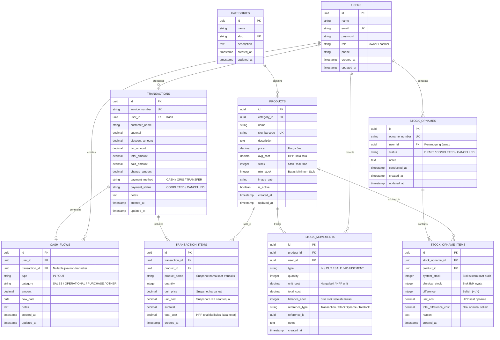

# 🗄️ Skema Database & Entity Relationship Diagram (ERD) - KasirKita POS

Dokumen ini merinci desain arsitektur basis data **PostgreSQL** untuk KasirKita POS, yang mengintegrasikan sistem kasir multi-platform, pencatatan inventaris **Perpetual System**, kalkulasi **Average Cost (HPP)**, rekonsiliasi **Stock Opname**, dan laporan **Arus Kas (Cash Flow)**.

---

## 📊 Diagram Relasi Entitas (Mermaid ERD)

---

## 🔍 Penjelasan Tabel & Implementasi Metode Bisnis

### 1. Tabel `products` & `stock_movements` (Perpetual & Average Cost)
- **Perpetual System:** Kolom `products.stock` selalu diperbarui secara instan dan setiap perubahannya tercatat di `stock_movements` dengan kolom `balance_after`.
- **Average Cost Calculation:** Saat restock (tipe `IN`), HPP diupdate:
  $$\text{avg\_cost}_{\text{baru}} = \frac{(\text{stock}_{\text{lama}} \times \text{avg\_cost}_{\text{lama}}) + (\text{qty}_{\text{masuk}} \times \text{unit\_cost}_{\text{masuk}})}{\text{stock}_{\text{lama}} + \text{qty}_{\text{masuk}}}$$

### 2. Tabel `transactions` & `transaction_items` (Point of Sales)
- Menyimpan snapshot `unit_price` dan `unit_cost` pada saat transaksi terjadi.
- Memungkinkan perhitungan **Laba Kotor Riil**:
  $$\text{Laba Kotor} = \text{subtotal} - \text{total\_cost}$$

### 3. Tabel `stock_opnames` & `stock_opname_items` (Rekonsiliasi Fisik)
- Mengunci data stok sistem dan membandingkannya dengan hitungan fisik lapangan.
- Jika status disetujui (`COMPLETED`), sistem otomatis membuat mutasi `ADJUSTMENT` di `stock_movements` untuk menyeimbangkan stok.

### 4. Tabel `cash_flows` (Dasbor Keuangan & Arus Kas)
- Menampung pemasukan otomatis dari kasir (`SALES`) dan pencatatan manual pengeluaran operasional toko (listrik, gaji, belanja modal).

---

## ⚡ Rekomendasi Indexing (PostgreSQL Performance)
1. `products(sku_barcode)` — Index B-Tree untuk scan barcode instan.
2. `products(category_id)` — Index B-Tree untuk filter katalog cepat.
3. `stock_movements(product_id, created_at)` — Index komposit untuk riwayat kartu stok.
4. `transactions(invoice_number)` — Unique index.
5. `transactions(created_at, user_id)` — Index untuk agregasi laporan penjualan harian.
6. `cash_flows(flow_date, type)` — Index untuk grafik arus kas cepat.
